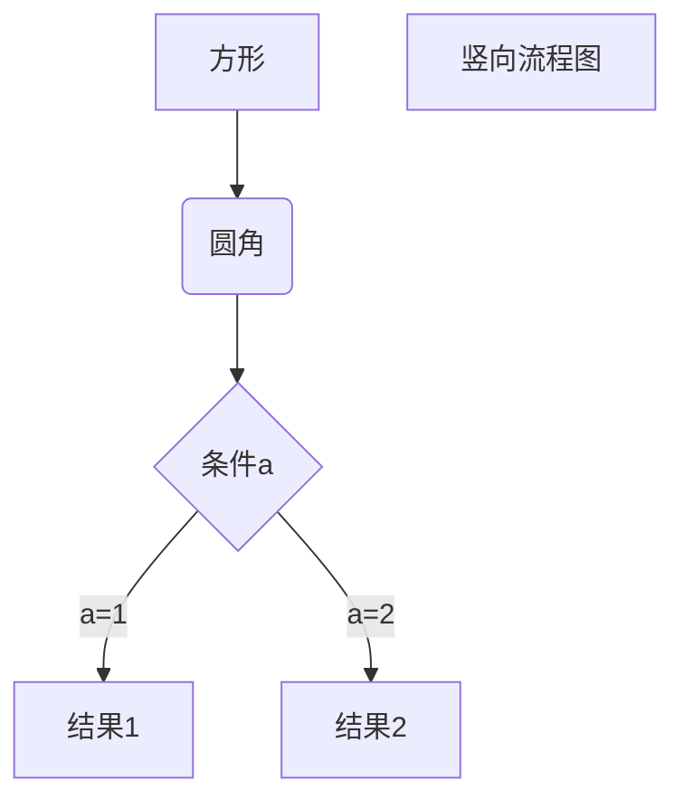

# interestingProblem
some interesting problem and answer
## 聚簇索引 非聚簇索引
1. 聚簇索引 数据位于叶子节点，innodb中也就是主键索引
2. 非聚簇索引 叶子节点为聚簇索引的索引键，需要二次扫描聚簇索引才能找到实际存储的数据
## 什么是B+树
balance tree

# 一、自我介绍（提前准备-背书，并根据面试过程调整）

二、项目介绍：准备2个自己可以把全部技术点说清楚的项目，最好自己主R；根据面试过程进行迭代；
技术&业务；业务背景对齐，逻辑架构，技术点
2.1 你的项目业务量增加十倍，要怎么做？
2.2 根据简历项目的技术点，逐个check

三、DB
3.1 分库分表，解决什么问题，带来了什么问题；如何进行分库分表？
解决主从延迟，插入慢，过大ddl慢； 
带来的问题，join，不带分库键查询触发全表扫描。
如何分库分表：选择什么分库键，业务使用的比如orderID，userID，poiID，分多少个每个表逾期3-5年1000万，2的倍数个表，未来迁移更容易，查询如何，含分库键路由到具体库表，不含全表扫描，或者辅助读分库键接binlog数据异构，join情况，小表复制，同规则join，limit则取更多数据，再合并
3.2 mysql高可用如何保证，异地多活、一主多从、路由策略
RTO，主从结构，主库异常，升级从库。主从复制：异步复制、同步复制、半同步复制、MGR，探测select XXX，主不可用，从可用则升级主，同机房优先（异地多活），配置更新，主从结构重置，客户端请求由配置读取，重连读取。url ip

3.3 索引，B+树why，前缀索引原因、如何实现事务、ACID、如何优化索引、执行计划有哪些属性，优化器准确吗，如何统计的。double write，日志redo、undo、存储
因为数据量大要放在磁盘存储，B+树层数少，查询时间复杂度低，顺序查找磁盘缓存友好，减少IO次数，索引缓存友好，对比HASH，连续内存，无法顺序对比红黑树，层数太高，查询复杂度更高，不连续。
前缀索引：(a,b,c), a，b，c索引存储顺序排列
如何实现事务：https://www.cnblogs.com/ffdsj/p/12266539.html，锁、mvcc、read/insert/update buffer、redo、undo、binlog
原子性：undo 隔离性：锁+mvcc 四种隔离级别，一致性：原子性+隔离性 持久性：redo
2pc：prepared，commit，
长时间等待resource
coroprator故障单点故障
commit无法保障通知到每个节点
3pc
 TCC。acid，update执行修改缓存页，写入undo，写undo的redo，Innodb flush at commit 1 写入redo cache并flush到文件，0 1秒写入redo  cache由操作系统管理，1000为1000个事务一次，写sync_binlog，1表示一个事务一次，0表示操作系统管理，大于1表示几秒一次 触发同步，得到从库ACK，commit，隔离性（锁），持久性（redo undo），事务隔离级别
如何优化索引：索引分析explan，type（const，field，index，range，all）， possiblekey， key，extend（wherecondition，fileSort，index condition），row（并不准确，定期统计数据量）
double write，写入 insert buffer，后批量写入磁盘
3.4 事务传播机制，有哪些问题，7种，required，supported，mandonary, not supported，required_new, never, nested 
3.5 mysql隔离级别，mvcc（多版本并发控制解决插入更新回滚）、间隙锁  ruc 脏读 rc幻读，rr 不可重复读（innodb解决不可重复读 采用next key），sealizable
3.6 事务一致性，坑点undolog
3.7 DTS实现原理，binlog读取，kafka消息，环形队列，并发

四、网路
4.1 网关平台有哪些技术点 http<->rpc
4.2 https为什么比http安全
4.3 加密算法有哪些
4.4 ssl；对称&非对称，为什么使用ssl握手阶段使用非对称，报文加密使用对称。
4.5 http错误码有哪些，说明原因
4.6 三次握手、四次挥手；为什么是3、4次；等待2个时钟的原因
4.7 http协议seq是如何生成的，随机的？为什么随机

五、算法
5.1 N数组，3个数和为10，去重打印
5.2 三个线程，按顺序打印数组中的值
5.3 最长连续子串
5.4 希尔、快排
5.5 有序链表去重
5.6 二叉树，根到叶子节点和是否等于sum

六、稳定性
限流、熔断、降级
数据一致性

七、redis
7.1 穿透、雪崩、击穿；什么场景发生，如何解决
7.2 redis集群，种类？redis是什么系统 cap理论
7.3 redis数据结构，五种数据类型，底层结构是什么，skipList，跟二叉树的区别
7.4 redis rehash过程，为什么这么做
7.5 redis单线程？如何提供快速响应

八、人性
8.1 为什么换工作
8.2 给你一个团队你准备怎么做
8.3 离职原因
8.4 职业规划
8.5 反问，注意别问面试官无法回答的问题，很坑！！！

九、linux操作系统
9.1 jvm中专用cpu最多的线程
9.2 nginx日志中找出top10请求ip
9.3 服务监听接口

十、java
10.1 垃圾回收 cms、G1
10.2 一致性hash实现、解决的问题，分布不均的解决方案
10.3 线程池参数设置
10.4 jdk8 list convert map，函数接口

十一、消息队列
11.1 kafka和rocketmq区别，如何选型
11.2 kafka为什么效率高（producer、broker、consumer），瓶颈是什么
11.3 kafka刷盘策略
11.4 零拷贝

十二、场景
12.1 秒杀
12.2 微信朋友圈
12.3 订单系统，根据订单可以排序，ID生成器；有序，严格有序。
