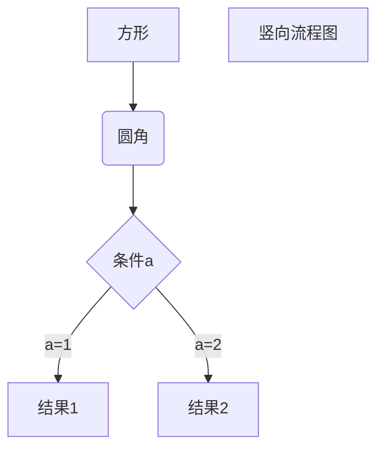

# interestingProblem
some interesting problem and answer
## 聚簇索引 非聚簇索引
1. 聚簇索引 数据位于叶子节点，innodb中也就是主键索引
2. 非聚簇索引 叶子节点为聚簇索引的索引键，需要二次扫描聚簇索引才能找到实际存储的数据
## 什么是B+树
balance tree

```mermaid
graph TD
A[方形] --> B(圆角)
    B --> C{条件a}
    C --> |a=1| D[结果1]
    C --> |a=2| E[结果2]
    F[竖向流程图]
```
